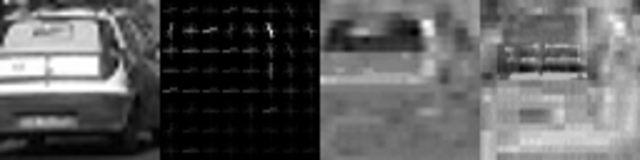
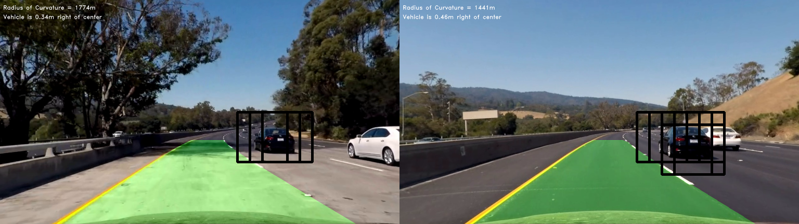
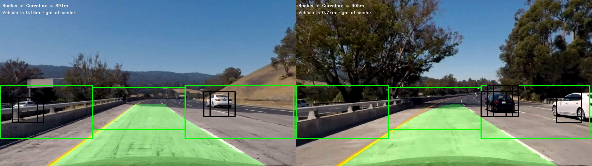
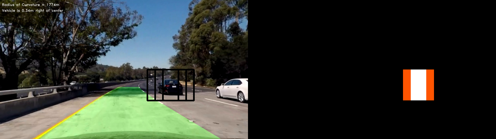
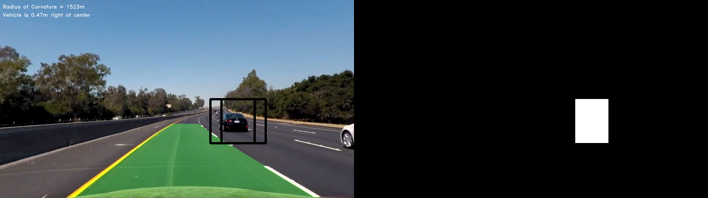
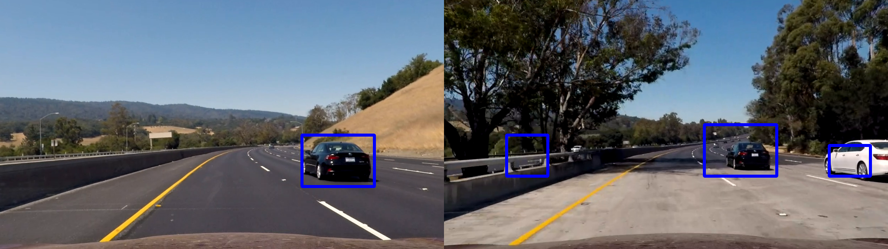
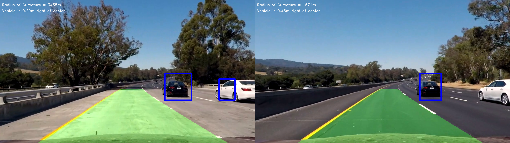
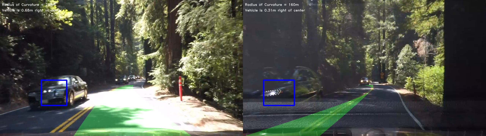

# Vehicle Detection Project

| Note    | |
|:-----------|:-------------|
| **Source Code**  | https://github.com/aurangzaib/CarND-Vehicle-Detection  |
| **Car training data**  | https://s3.amazonaws.com/udacity-sdc/Vehicle_Tracking/vehicles.zip      |
| **Not-car training data**  | https://s3.amazonaws.com/udacity-sdc/Vehicle_Tracking/non-vehicles.zip      |
| **How to run**  | `cd implementation && python main.py`      |

The steps of the project are the following:

- Perform a Histogram of Oriented Gradients (`HOG`), Color Transform and Spatial Bining to extract features on a labeled training set of images.

- Randomize and normalize the features and train a `SVM` classifier.

- Implement a sliding-window technique with `HOG` sub-sampling and use the trained classifier to search for vehicles in images by predicting the labels for each feature.

- Create a `heat map` of recurring detections.

- Remove `false positives` and Update the bounding boxes for vehicles detected.

---

### 1-	Feature Extraction

| Source Code Reference    |  |
|:-----------|:-------------|
| File  | `implementation/feature_extraction.py`  |
| Method  | `FeatureExtraction.bin_spatial`      |
| Method  | `FeatureExtraction.color_hist`      |
| Method  | `FeatureExtraction.get_hog_features`      |

-	Reading in all the `vehicle` and `non-vehicle` images.
-	For `Spatial Bining`, we resize the image to `32x32` and use numpy `ravel` for each color channel to get features vector.
-	For `Color Histogram`, we use numpy `histogram` for each channel and concatenate the result.
-	For `HOG` features, skimage `hog` is used with predefined following parameters.

| HOG parameters    |Value  |
|:-----------|:-------------|
| Orientation  | 10  |
| Pixel per cell  | 8      |
| Cell per block  | 2      |
| Color space  | YCrCb      |

```python
def bin_spatial(img, size=(32, 32)):
    color1 = cv.resize(img[:, :, 0], size).ravel()
    color2 = cv.resize(img[:, :, 1], size).ravel()
    color3 = cv.resize(img[:, :, 2], size).ravel()
    return np.hstack((color1, color2, color3))
```
``` python
def color_hist(img, nbins=32):  # bins_range=(0, 256)
    channel1_hist = np.histogram(img[:, :, 0], bins=nbins)[0]
    channel2_hist = np.histogram(img[:, :, 1], bins=nbins)[0]
    channel3_hist = np.histogram(img[:, :, 2], bins=nbins)[0]
    
    hist_features = np.concatenate((channel1_hist, 
                                    channel2_hist, 
                                    channel3_hist))
    return hist_features
```

```python
def get_hog_features(img, feature_vec=False, folder="", filename=None):
    features = hog(img,
                   orientations=config["orient"],
                   pixels_per_cell=(config["pix_per_cell"],
                                    config["pix_per_cell"]),
                   cells_per_block=(config["cell_per_block"],
                                    config["cell_per_block"]),
                   transform_sqrt=True,
                   visualise=False,
                   feature_vector=feature_vec)
    return features
```
Here is an example of HOG features of training data samples:

1: `Original Image`. 2:  `Channel 1 HOG features` 3: `Channel 2` 4: `Channel 3`





### 2-	Training SVM Classifier:

| Source Code Reference    |  |
|:-----------|:-------------|
| File  | `implementation/classifier.py`  |
| Method  | `Classifier.normalize_features`      |
| Method  | `Classifier.get_trained_classifier`      |

-	Randomize dataset using numpy `shuffle`.
-	Normalize features using sklearn `StandardScaler`.
Using Support Vector Machine (`SVM`) classifier to fit on the training features and labels.
-	Save the trained classifier as `pickle` file for reuse.

Parameter for `SVM` classifier found using `GridSearchCV` are as follows:

| SVM parameters    |Value  |
|:-----------|:-------------|
| Kernel  | rbf  |
| C  | 10      |

```python
not_cars = glob.glob(config["training_not_cars"])
cars = glob.glob(config["training_cars"])

# files for cars and not cars
not_cars_files = [img_file for img_file in not_cars]
cars_files = [img_file for img_file in cars]

# features for cars and not cars
car_features = FeatureExtraction.extract_features(cars_files)
not_cars_features = FeatureExtraction.extract_features(not_cars_files)

# append the feature vertically -- i.e. grow in rows with rows constant
features = np.vstack((car_features, not_cars_features)).astype(np.float64)

# normalize the features
features, scaler = Classifier.normalize_features(features)

# labels
labels = np.hstack((np.ones(len(cars_files)), np.zeros(len(not_cars_files))))

# shuffle dataset
features, labels = shuffle(features, labels)

# initialize SVM with optimized params using GridSearchCV
# best params --> kernel='rbf', C=10
# but makes the classifier slow
clf = SVC()

# train the classifier
clf.fit(features, labels)

print("classifier trained.")

pickle.dump({"clf": clf, "x_scaler": scaler}, open(config["classifier"], 'wb'))
return clf, scaler
```
### 3-	Sliding Window Search with HOG subsampling:

| Source Code Reference    |  |
|:-----------|:-------------|
| File  | `implementation/window_search.py`  |
| Method  | `WindowSearch.get_window_params`      |
| Method  | `WindowSearch.get_frame_hog`      |
| Method  | `WindowSearch.get_box`      |
| Method  | `WindowSearch.get_bounding_boxes`      |

-	Get `HOG` features for each full image:
	-	Get Region of Interest (`ROI`) which is lower half of the image.
    -	Find number of search steps using window size and number of windows.
    -	Get `HOG` features of `Y`, `Cr` and `Cb` channels individually.
    
```python
y_start, y_stop = y_start_top

img_tosearch = img[y_start:y_stop, :, :]
ctrans_tosearch = Helper.convert_color(img_tosearch, conv='RGB2YCrCb')
if config["scale"] != 1:
    imshape = ctrans_tosearch.shape
    ctrans_tosearch = cv.resize(ctrans_tosearch,
                                (np.int(imshape[1] / config["scale"]),
                                 np.int(imshape[0] / config["scale"])))

ch1 = ctrans_tosearch[:, :, 0]
ch2 = ctrans_tosearch[:, :, 1]
ch3 = ctrans_tosearch[:, :, 2]

# Define blocks and steps as above
n_xblocks = (ch1.shape[1] // config["pix_per_cell"]) - config["cell_per_block"] + 1
n_yblocks = (ch1.shape[0] // config["pix_per_cell"]) - config["cell_per_block"] + 1

# 64 was the original sampling rate, with 8 cells and 8 pix per cell
window = 64
n_blocks_per_window = (window // config["pix_per_cell"]) - config["cell_per_block"] + 1
cells_per_step = 2
# Instead of overlap, define how many cells to step
n_xsteps = (n_xblocks - n_blocks_per_window) // cells_per_step
n_ysteps = (n_yblocks - n_blocks_per_window) // cells_per_step

# Compute individual channel HOG features for the entire image
# Y channel
hog1 = FeatureExtraction.get_hog_features(ch1, folder="../buffer/hog-features/")
# Cr  channel
hog2 = FeatureExtraction.get_hog_features(ch2)
# Cb channel
hog3 = FeatureExtraction.get_hog_features(ch3)
```
-	Loop over the windows in `x` and `y` direction:
    -	Get subsample of image for each window.
	-	Get subsample of `HOG` features for each window.
    -	Get Spatial and Color Histogram features of the subsample.
    -	Use HOG, Spatial and Color features to predict the labels using pretrained SVM classifier.
    -	Get the coordinates of bounding boxes if the classifier predicts the label as a car.
    
| Window Search parameters    |Value  |
|:-----------|:-------------|
| Number of Windows  | 64  |
| Scale  | 1.5  |
| Number of X Blocks  | 84  |
| Number of Y Blocks  | 23      |
| Number of X Steps  | 38      |
| Number of Y Steps  | 8      |
| Subsample Size  | 192, 682      |
```python
for xb in range(n_xsteps):
    for yb in range(n_ysteps):
        y_pos = yb * cells_per_step
        x_pos = xb * cells_per_step

        # Extract HOG for this patch
        hog_feat1 = hog1[y_pos:y_pos + n_blocks_per_window, x_pos:x_pos + n_blocks_per_window].ravel()
        hog_feat2 = hog2[y_pos:y_pos + n_blocks_per_window, x_pos:x_pos + n_blocks_per_window].ravel()
        hog_feat3 = hog3[y_pos:y_pos + n_blocks_per_window, x_pos:x_pos + n_blocks_per_window].ravel()

        x_left = x_pos * config["pix_per_cell"]
        y_top = y_pos * config["pix_per_cell"]

        # Extract the image patch
        sub_sample_img = cv.resize(ctrans_tosearch[y_top:y_top + window, x_left:x_left + window], (64, 64))

        # Get color and gradient features for each image patch
        hog_features = np.hstack((hog_feat1, hog_feat2, hog_feat3))
        spatial_features = FeatureExtraction.bin_spatial(sub_sample_img, size=config["spatial_size"])
        hist_features = FeatureExtraction.color_hist(sub_sample_img, nbins=config["hist_bins"])

        # append merge features
        feature = np.hstack((spatial_features, hist_features, hog_features))

        # normalize the features
        features = scaler.transform(np.array(feature).reshape(1, -1))

        # predict the label for the features: 1 = car, 0 = not car
        predicted_labels = svc.predict(features)

        # get the bounding box for detected cars
        if predicted_labels == 1:
            bounding_boxes.append(WindowSearch.get_box(x_left, y_start, y_top, window))
``` 

| Window Search parameters    |Value  |
|:-----------|:-------------|
| Number of Windows  | 64  |
| Scale  | 1.5  |
| Number of X Blocks  | 84  |
| Number of Y Blocks  | 23      |
| Number of X Steps  | 38      |
| Number of Y Steps  | 8      |
| Subsample Size  | 192, 682      |
	
  



To optimize the pipeline speed, the Region of Interest (ROI) is improved such that the extras regions are not part of window search.

| ROI parameters    |Value  |
|:-----------|:-------------|
| Left Side  | (0, 400), (370, 600)  |
| Top Side  | (400, 800), (410, 450)  |
| Right Side  | (800, 1270), (370, 600)  |


```python
bounding_boxes = []  # get bounding boxes for left side
x_start_stop_left, y_start_stop_left = (0, 400), (370, 600)
bounding_boxes += WindowSearch.get_bounding_boxes(img, classifier,
                                                  x_start_stop_left,
                                                  y_start_stop_left)
# # get bounding boxes for top side
x_start_stop_top, y_start_stop_top = (400, 800), (410, 450)
bounding_boxes += WindowSearch.get_bounding_boxes(img, classifier,
                                                  x_start_stop_top,
                                                  y_start_stop_top)
# get bounding boxes for right side
x_start_stop_right, y_start_stop_right = (800, 1270), (370, 600)
bounding_boxes += WindowSearch.get_bounding_boxes(img, classifier,
                                                  x_start_stop_right,
                                                  y_start_stop_right)
```




### 4-	Find the Heatmaps and remove false positives:

| Source Code Reference    |  |
|:-----------|:-------------|
| File  | `implementation/helper.py`  |
| Method  | `Helper.add_heat`      |
| Method  | `Helper.get_heatmap`      |

- Increment heat value (+1) for all pixels within windows where a positive detection is reported by your classifier.
-	Apply thresholding on the heatmap.

```python
for box in bbox_list:
    # Add += 1 for all pixels inside each bbox
    # Assuming each "box" takes the form ((x1, y1), (x2, y2))
    heatmap[box[0][1]:box[1][1], box[0][0]:box[1][0]] += 1
    # Return updated heatmap
return heatmap
```

| Heatmap parameters    |Value  |
|:-----------|:-------------|
| Threshold  | 2      |

```python
# Apply threshold to help remove false positives
heat_binary = heatmap[heatmap <= threshold] = 0
heatmap_binary = np.clip(heat_binary, 0, 1)
```





### 5-	Update bounding boxes:

| Source Code Reference    |  |
|:-----------|:-------------|
| File  | `implementation/helper.py`  |
| Method  | `Helper.remove_false_positives`      |
| Method  | `Helper.draw_updated_boxes`      |

To update the previously found duplicates and false postive bounding boxes:
-	Using sklearn `measurements` to remove false positive.
-	Iterate through all car labels i.e. 1.
	-	Get `x` and `y` pixel positions.
    -	Define top left and bottom right coordinates of a rectangle.
    -	Draw bounding box using opencv `rectangle`.
    
```python
heat = np.zeros_like(img[:, :, 0]).astype(np.float)  # Add heat to each box in box list
heat = Helper.add_heat(heat, bounding_boxes)

# Get binary heat map
heatmap_binary = Helper.get_heatmap(heat)

# Find final boxes from heatmap using label function
labels = label(heatmap_binary)

# show box where label is 1
detected_cars = Helper.draw_updated_boxes(np.copy(img), labels)
```





### 6-	Combining results with Lane Detection:


The results of vehicle detection are combined with lane detection from previous project.






Here is the video of the complete pipeline:

[](http://www.youtube.com/watch?v=ngW_dDmAKjY)


Discussion
------------------

####1. Briefly discuss any problems / issues you faced in your implementation of this project.  Where will your pipeline likely fail?  What could you do to make it more robust?

Here I'll talk about the approach I took, what techniques I used, what worked and why, where the pipeline might fail and how I might improve it if I were going to pursue this project further.  

