# Vehicle Detection Project

| Note    | |
|:-----------|:-------------|
| **Source Code**  | https://github.com/aurangzaib/CarND-Vehicle-Detection  |
| **Car training data**  | https://s3.amazonaws.com/udacity-sdc/Vehicle_Tracking/vehicles.zip      |
| **Not-car training data**  | https://s3.amazonaws.com/udacity-sdc/Vehicle_Tracking/non-vehicles.zip      |
| **How to run**  | `cd implementation && python main.py`      |

The steps of the project are the following:

- Perform a Histogram of Oriented Gradients (`HOG`), Color Transform and Spatial Bining to extract features on a labeled training set of images.

- Randomize and normalize the features and train a `SVM` classifier.

- Implement a sliding-window technique with `HOG` sub-sampling and use the trained classifier to search for vehicles in images by predicting the labels for each feature.

- Create a `heat map` of recurring detections.

- Remove `false positives` and Update the bounding boxes for vehicles detected.

---

### 1-	Feature Extraction

| Source Code Reference    |  |
|:-----------|:-------------|
| File  | `implementation/feature_extraction.py`  |
| Method  | `FeatureExtraction.bin_spatial`      |
| Method  | `FeatureExtraction.color_hist`      |
| Method  | `FeatureExtraction.get_hog_features`      |

Here are a few samples of vehicle and non-vehicle training datasets:

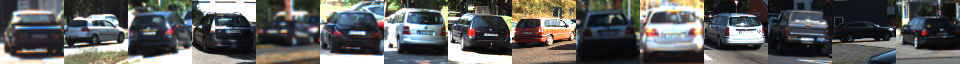

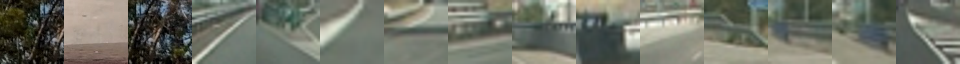

The algorithm is as follows:

-	Reading in all the `vehicle` and `non-vehicle` images.
-	For `Spatial Bining`, we resize the image to `32x32` and use numpy `ravel` for each color channel to get features vector.
-	For `Color Histogram`, we use numpy `histogram` for each channel and concatenate the result.
-	For `HOG` features, skimage `hog` is used with predefined following parameters.

The combination of parameters are found after running a battery of tests on small datasets. Parameters are selected for best balance of time and prediction accuracy.

| Source Code Reference    |  |
|:-----------|:-------------|
| File  | `implementation/classifier.py`  |
| Method  | `Classifier.evaluate_classifier_parameters`      |
| Car training data  | https://s3.amazonaws.com/udacity-sdc/Vehicle_Tracking/vehicles_smallset.zip      |
| Not-car training data  | https://s3.amazonaws.com/udacity-sdc/Vehicle_Tracking/non-vehicles_smallset.zip      |

Following are the results of the optimal parameters search:

| Orient    |Channel  |Colorspace  | Accuracy (%)  |Train time (s) |Predict time (s)  |
|:-----------|:-------------|:-------------|:-------------|:-------------|:-------------|
| 08  | R  |RGB  |98.06  |10  |2  |
| 10  | R  |RGB  |98.7  |11  |3  |
| 10  | ALL  |RGB  |99.1  |22  |6  |
| 10  | Y  |YCrCb  |98.49  |10  |4  |
| 10  | ALL  |YCrCb  |100  |16  |4  |
| 10  | ALL  |LUV  |99.56  |16  |4  |
| 10  | ALL  |HLS  |99.78  |17  |4  |
| 10  | ALL  |HSV  |99.84  |16  |4  |
| 12  | ALL  |RGB  |99.5  |25  |7  |

Following parameters combination is selected:

| HOG parameters    |Value  |
|:-----------|:-------------|
| Orientation  | 10  |
| Pixel per cell  | 8      |
| Cell per block  | 2      |
| Color space  | YCrCb      |

Here is an example of HOG features of training data samples:

1: `Original Image`. 2:  `Channel 1 HOG features` 3: `Channel 2` 4: `Channel 3`

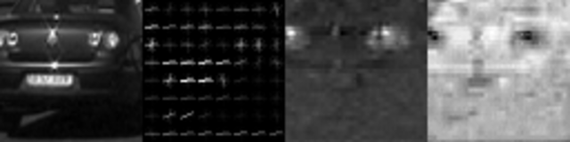
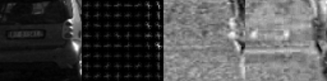
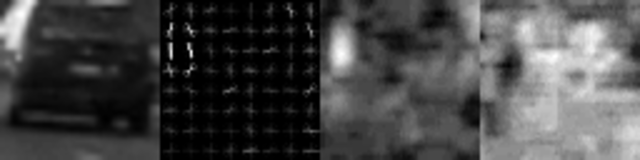
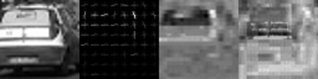

### 2-	Training SVM Classifier:

| Source Code Reference    |  |
|:-----------|:-------------|
| File  | `implementation/classifier.py`  |
| Method  | `Classifier.normalize_features`      |
| Method  | `Classifier.get_trained_classifier`      |

The algorithm is as follows:

-	Randomize dataset using numpy `shuffle`.
-	Normalize features using sklearn `StandardScaler`.
Using Support Vector Machine (`SVM`) classifier to fit on the training features and labels.
-	Save the trained classifier as `pickle` file for reuse.

Parameter for `SVM` classifier found using `GridSearchCV` are as follows:

| SVM parameters    |Value  |
|:-----------|:-------------|
| Kernel  | rbf  |
| C  | 0.001      |

	
### 3-	Sliding Window Search with HOG subsampling:

| Source Code Reference    |  |
|:-----------|:-------------|
| File  | `implementation/window_search.py`  |
| Method  | `WindowSearch.get_window_params`      |
| Method  | `WindowSearch.get_frame_hog`      |
| Method  | `WindowSearch.get_box`      |
| Method  | `WindowSearch.get_bounding_boxes`      |

The algorithm is as follows:

-	Get `HOG` features for each full image:
	-	Get Region of Interest (`ROI`) which is lower half of the image.
    -	Find number of search steps using window size and number of windows.
    -	Get `HOG` features of `Y`, `Cr` and `Cb` channels individually.
    
-	Loop over the windows in `x` and `y` direction:
    -	Get subsample of image for each window.
	-	Get subsample of `HOG` features for each window.
    -	Get Spatial and Color Histogram features of the subsample.
    -	Use HOG, Spatial and Color features to predict the labels using pretrained SVM classifier.
    -	Get the coordinates of bounding boxes if the classifier predicts the label as a car.
    
-	Determining the ROI:
	-	ROI is carefully chosen after experimentation to achieve a balance between prediction accuracy and time taken window searching.
    -	The larger the ROI, the more area is search by sliding window algorithm but the time taken will be higher.
    - Smaller ROI has shorter searching time but at the expense of missing potential regions to detect the vehicle. 
    
| ROI parameters    |Value  |
|:-----------|:-------------|
| Left Side  | (0, 400), (370, 600)  |
| Top Side  | (400, 800), (380, 560)  |
| Right Side  | (800, 1270), (370, 600)  |

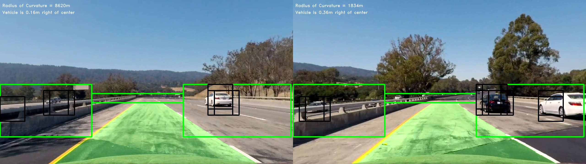
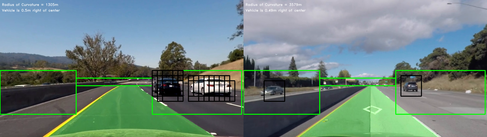
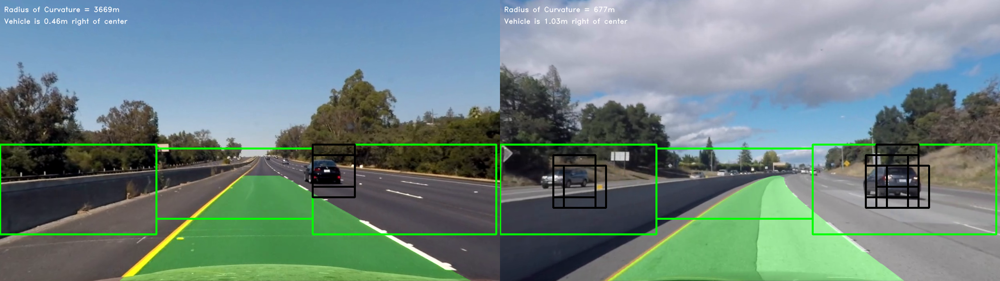

| Window Search parameters    |Value  |
|:-----------|:-------------|
| Number of Windows  | 64  |
| Scale  | 1.7  |
| Number of X Blocks  | 84  |
| Number of Y Blocks  | 23      |
| Number of X Steps  | 38      |
| Number of Y Steps  | 8      |
| Subsample Size  | 192, 682      |
	

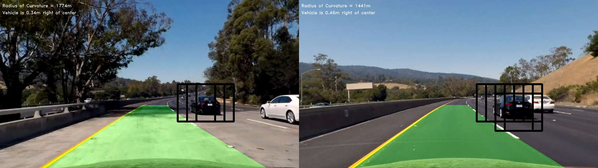
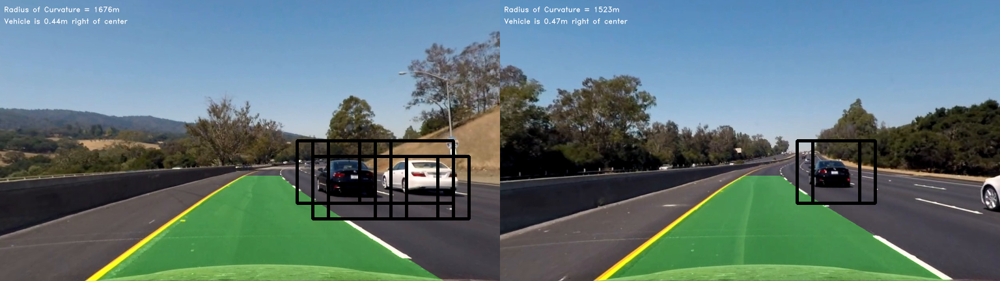

### 4-	Find the Heatmaps and remove false positives:

| Source Code Reference    |  |
|:-----------|:-------------|
| File  | `implementation/helper.py`  |
| Method  | `Helper.add_heat`      |
| Method  | `Helper.get_heatmap`      |

The algorithm is as follows:

- Increment heat value (+1) for all pixels within windows where a positive detection is predicted by your classifier.
-	Apply thresholding on the heatmap.

| Heatmap parameters    |Value  |
|:-----------|:-------------|
| Threshold  | 2      |

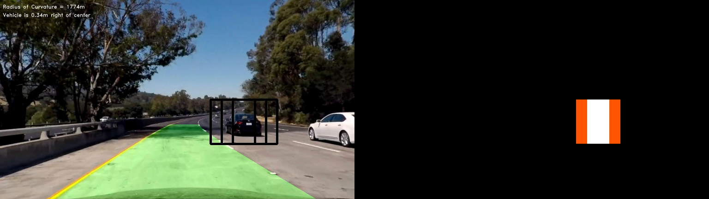
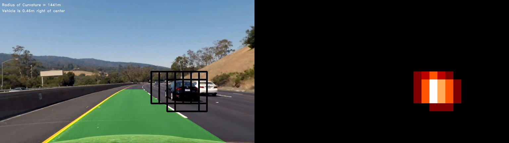
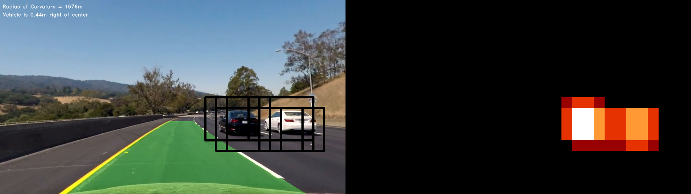

### 5-	Update bounding boxes:

| Source Code Reference    |  |
|:-----------|:-------------|
| File  | `implementation/helper.py`  |
| Method  | `Helper.remove_false_positives`      |
| Method  | `Helper.draw_updated_boxes`      |

To update the previously found duplicates and false postive bounding boxes:
-	Using sklearn `measurements` to remove false positive.
-	Iterate through all car labels:
	-	Get `x` and `y` pixel positions.
    -	Define top left and bottom right coordinates of a rectangle.
    -	Draw bounding box using opencv `rectangle`.
    
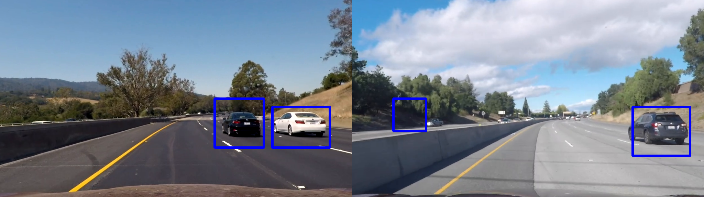
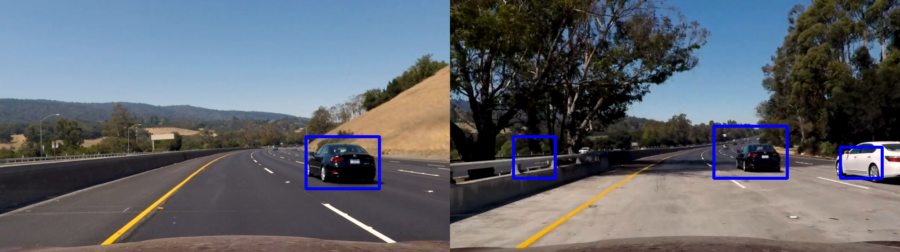
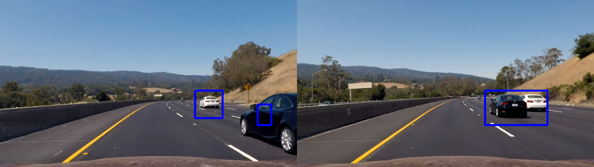

### 6-	Combining results with Lane Detection:

The results of vehicle detection are combined with lane detection from previous project.

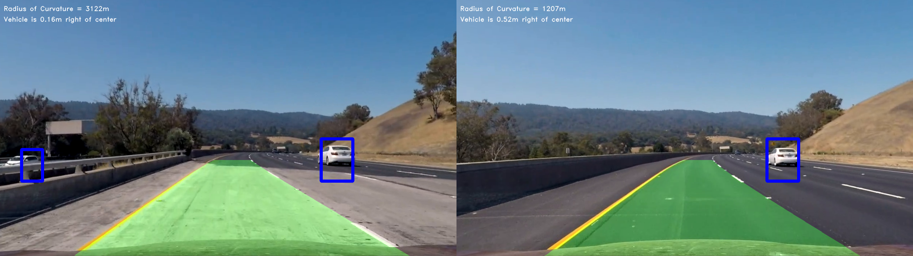
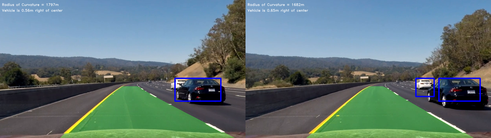
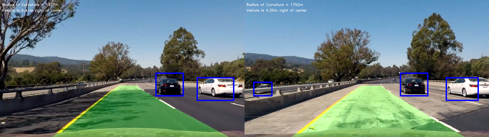
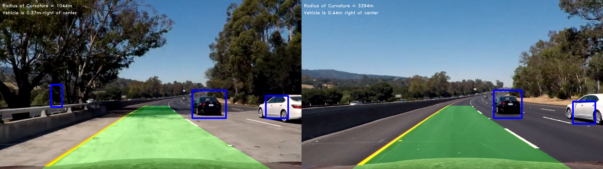
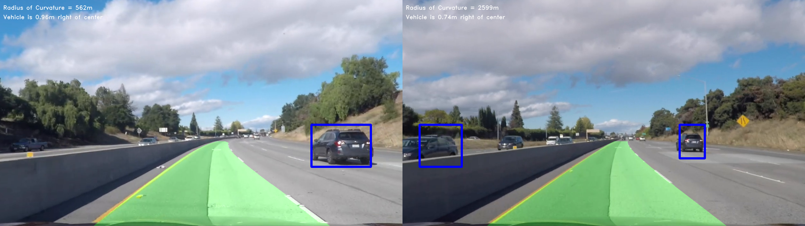
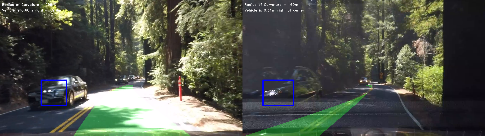

Here is the video of the complete pipeline:

Discussion
------------------

##### Possible Improvements:
-	Using Convolutional Neural Networks (CNN) can be much faster compared to Support Vector Machine (SVM), also to reduce the dependency on window sliding algorithm.
- Region of Interest (ROI) can be further improved by generating a trapezoid dynamically instead of hardcoded rectangle coordinates.

##### Potential failure points and problems with current pipeline:
-	Varying light conditions and trees shadow.
-	Pipeline will most definitely fail in snow conditions.
-	Pipeline has issues with overlapping cars.
- The vehicle detection is not fast enough to be realtime, specially sliding window search algorithm even after improvements in Region of Interest (ROI).
- Classifier may not predict Trucks, motorbikes etc. as it is trained only on cars' datasets.
- The pipeline will have issues with high elevations due to fixed Region of Interest (ROI).

