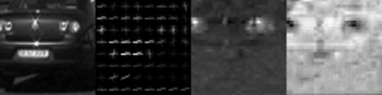
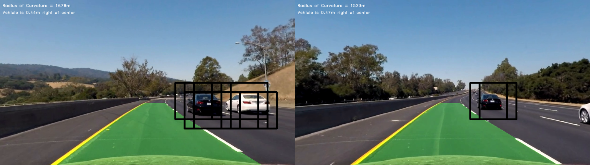
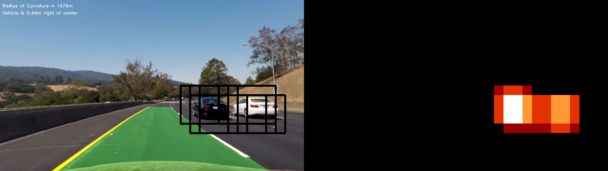

# Vehicle Detection Project

| Note    | |
|:-----------|:-------------|
| **Source Code**  | For complete implementation of the project:  https://github.com/aurangzaib/CarND-Vehicle-Detection  |
| **How To Run**  | `cd implementation && python main.py`      |

The steps of the project are the following:

- Perform a Histogram of Oriented Gradients (HOG), Color Transform and Spatial Bining to extract features on a labeled training set of images.

- Randomize and normalize the features and train a classifier SVM classifier.

- Implement a sliding-window technique with HOG sub-sampling and use the trained classifier to search for vehicles in images by predicitng the labels for each feature.

- Create a heat map of recurring detections frame by frame to reject outliers and follow detected vehicles.

- Estimate a bounding box for vehicles detected.

[//]: # (Image References)
[image1]: ./examples/car_not_car.png
[image2]: ./examples/HOG_example.jpg
[image3]: ./examples/sliding_windows.jpg
[image4]: ./examples/sliding_window.jpg
[image5]: ./examples/bboxes_and_heat.png
[image6]: ./examples/labels_map.png
[image7]: ./examples/output_bboxes.png
[video1]: ./project_video.mp4

### 1-	Feature Extraction

| Source Code Reference    |  |
|:-----------|:-------------|
| File  | `implementation/feature_extraction.py`  |
| Method  | `FeatureExtraction.bin_spatial`      |
| Method  | `FeatureExtraction.color_hist`      |
| Method  | `FeatureExtraction.get_hog_features`      |

-	Reading in all the `vehicle` and `non-vehicle` images.
-	For Spatial Bining, we resize the image to 32x32 and use numpy `ravel` for each color channel to get features vector.
-	For Color Histogram, we use numpy `hiostogram` for each channel and concatenate them.
-	For HOG features, skimage `hog` is used with predefined following parameters.

| HOG parameters    |Value  |
|:-----------|:-------------|
| Orient  | 10  |
| Pixel per cell  | 8      |
| Cell per block  | 2      |
| Spatial size  | 32x32      |
| Color space  | YCrCb      |

Here is an example of HOG features of training data samples:

1: `Original Image`. 2:  `Channel 1 HOG features` 3: `Channel 2` 4: `Channel 3`

### 2-	Training SVM Classifier:

| Source Code Reference    |  |
|:-----------|:-------------|
| File  | `implementation/classifier.py`  |
| Method  | `Classifier.normalize_features`      |
| Method  | `Classifier.get_trained_classifier`      |

-	Randomize dataset using numpy `shuffle`.
-	Normalize features using sklearn `StandardScaler`.
Using Support Vector Machine (SVM) classifier to train on the features and labels.
-	Save the trained classifier as `pickle` file.

Parameter for SVM classifier found using `GridSearchCV` are as follows:

| SVM parameters    |Value  |
|:-----------|:-------------|
| Kernel  | rbf  |
| C  | 10      |

### 3-	Sliding Window Search with HOG subsampling:

| Source Code Reference    |  |
|:-----------|:-------------|
| File  | `implementation/window_search.py`  |
| Method  | `WindowSearch.get_frame_hog`      |
| Method  | `WindowSearch.get_box`      |
| Method  | `WindowSearch.get_bounding_boxes`      |

-	Get HOG features for each full image:
	-	Get Region of Interest (ROI) which is lower half of the image.
    -	Find number of search steps using window size and number of windows.
    -	Get Y, Cr and Cb channels HOG features individually.
    
-	Loop over the windows in x and y direction:
    -	Get subsample of image of each window.
	-	Get subsample of HOG featuers of each window.
    -	Get Spatial and Color Histogram fratures.
    -	Use HOG, Spatial and Color features to predict the labels using pretrained SVM classifier.
    -	Get the coordiantes of bounding boxes whenever the classifier predicts the label as a car.
    
| Window Search parameters    |Value  |
|:-----------|:-------------|
| Window Size  | 96, 96      |
| Window Overlap  | 0.5      |
| Number of Windows  | 64  |
| Scale  | 1.5  |
| Number of X Blocks  | 84  |
| Number of Y Blocks  | 23      |
| Number of X Steps  | 38      |
| Number of Y Steps  | 8      |
| Subsample Size  | 192, 682      |
	
  

### 4-	Find the Heatmaps:

| Source Code Reference    |  |
|:-----------|:-------------|
| File  | `implementation/helper.py`  |
| Method  | `Helper.add_heat`      |
| Method  | `Helper.get_heatmap`      |

####2. Show some examples of test images to demonstrate how your pipeline is working.  What did you do to optimize the performance of your classifier?

Ultimately I searched on two scales using YCrCb 3-channel HOG features plus spatially binned color and histograms of color in the feature vector, which provided a nice result.  Here are some example images:

![alt text][image4]
---

### Video Implementation

####1. Provide a link to your final video output.  Your pipeline should perform reasonably well on the entire project video (somewhat wobbly or unstable bounding boxes are ok as long as you are identifying the vehicles most of the time with minimal false positives.)
Here's a [link to my video result](./project_video.mp4)

####2. Describe how (and identify where in your code) you implemented some kind of filter for false positives and some method for combining overlapping bounding boxes.

I recorded the positions of positive detections in each frame of the video.  From the positive detections I created a heatmap and then thresholded that map to identify vehicle positions.  I then used `scipy.ndimage.measurements.label()` to identify individual blobs in the heatmap.  I then assumed each blob corresponded to a vehicle.  I constructed bounding boxes to cover the area of each blob detected.  

Here's an example result showing the heatmap from a series of frames of video, the result of `scipy.ndimage.measurements.label()` and the bounding boxes then overlaid on the last frame of video:

### Here are six frames and their corresponding heatmaps:

![alt text][image5]

### Here is the output of `scipy.ndimage.measurements.label()` on the integrated heatmap from all six frames:
![alt text][image6]

### Here the resulting bounding boxes are drawn onto the last frame in the series:
![alt text][image7]

---

###Discussion

####1. Briefly discuss any problems / issues you faced in your implementation of this project.  Where will your pipeline likely fail?  What could you do to make it more robust?

Here I'll talk about the approach I took, what techniques I used, what worked and why, where the pipeline might fail and how I might improve it if I were going to pursue this project further.  

